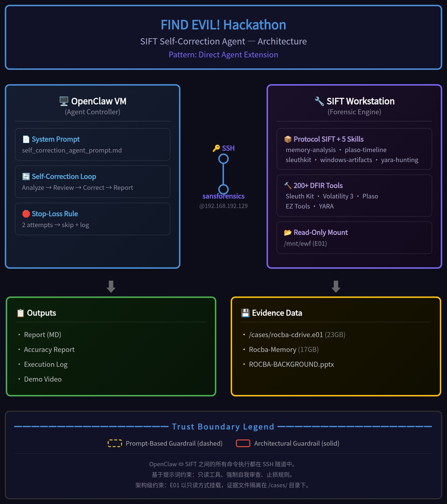
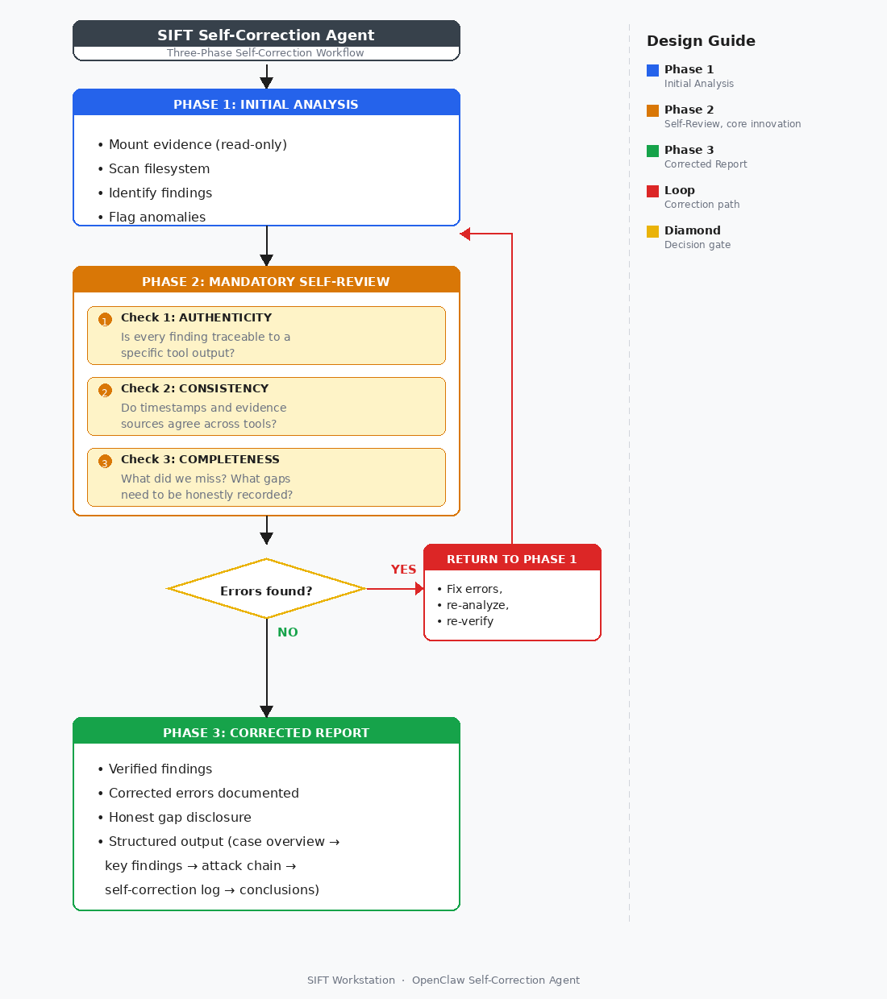
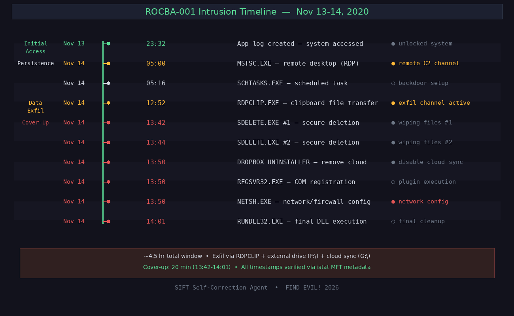

# SIFT Self-Correction Agent

A Protocol SIFT extension that teaches the AI analyst to double-check its own work — reducing hallucinations and making automated DFIR results more trustworthy.

**FIND EVIL! Hackathon 2026 Submission**

## Architecture

This project uses **Direct Agent Extension** architecture:
 
┌─────────────────┐   SSH   ┌────────────────────┐
│ OpenClaw (Agent)│ ◄─────► │ SIFT Workstation   │
│ (Reasoning +    │         │ (Forensic Tools)   │
│ Self-Correction)│         │ IP: 192.168.192.129│
└─────────────────┘         └────────────────────┘

- **Prompt-based guardrails**: Agent instructions enforce read-only tool usage and mandatory self-correction.
- See `architecture.png` for detailed component diagram.

## Self-Correction Workflow

The Agent follows a mandatory three-phase workflow: Initial Analysis → Mandatory Self-Review (Authenticity, Consistency, Completeness checks) → Corrected Report. If errors are found during Self-Review, the Agent returns to Analysis for correction before generating the final report.

## Project Structure
├── self_correction_agent_prompt.md # Core agent system instructions
├── skills/ # Protocol SIFT skill packs (5 skills)
├── analysis_report.md # Full investigative report (ROCBA-001)
├── accuracy_report.md # Accuracy self-assessment
├── execution_log.md # Structured tool execution log
├── architecture.png # Architecture diagram
├── README.md
└── LICENSE # MIT License

## Key Features

 ·Self-Correction Loop: Agent checks its own findings for hallucinations, inconsistencies, and missed artifacts before finalizing a report.
 ·Honest Uncertainty: Confirmed findings are clearly distinguished from inferences; skipped analyses are honestly recorded.
 ·Experimental Methodology: Inspired by data science competition workflows — control variables, baseline comparison, iterative testing.

## Built With
 ·OpenClaw (Agent Framework)
 ·SIFT Workstation (Forensic Platform)
 ·Protocol SIFT (AI-DFIR Integration)
 ·Sleuth Kit (fls, icat)
 ·Python (pptx parsing, data extraction)
 ·Bash

## Author
  Cheng Lin — Solo Participant, FIND EVIL! 2026

## License
  MIT — see LICENSE file

## Limitations & Future Work

### Known Limitations

1. **Prompt-Level Guardrails**: The current architecture uses prompt-based restrictions to enforce read-only tool usage. While the Agent confirmed no write commands were executed during testing, a maliciously crafted prompt could theoretically bypass these restrictions. This is honestly documented in the accuracy report.

2. **Single-Agent Architecture**: The current implementation uses a single Agent for both analysis and self-review. A multi-agent architecture — where one agent analyzes and a second independently verifies — could provide stronger separation of concerns.

3. **Skipped Analyses**: Three analysis dimensions (Event Logs, memory analysis via Volatility, and Prefetch timestamps) were skipped per stop-loss rules. Memory analysis was blocked by missing Windows ISF symbol files (symbol server returned HTTP 204). Registry hive analysis was completed in a supplementary update (2026-05-31). These gaps are honestly recorded.

4. **Manual SSH Setup**: The current workflow requires manual SSH configuration. Future versions could automate the connection setup through MCP-based agent-to-workstation integration.

### Planned Improvements

1. **Custom MCP Server Architecture**: Migrate from Direct Agent Extension to a Custom MCP Server. This would expose only type-safe, read-only forensic functions — making evidence spoliation architecturally impossible rather than prompt-dependent.

2. **Multi-Agent Decomposition**: Implement a two-agent system: Analyzer Agent + Verifier Agent. The Verifier independently checks the Analyzer's findings, providing stronger self-correction guarantees.

3. **Expanded Analysis Coverage**: Complete Event Log parsing, Volatility memory analysis (once symbol files are available), and Prefetch timestamp extraction.

4. **Automated Evidence Integrity Verification**: Add cryptographic hashing of evidence files before and after analysis to provide tamper-proof chain of custody documentation.

## Demo Video
🎥 [Watch the 5-minute demo](https://youtube.com/placeholder) *(link coming soon)*
## Setup & Try-It-Out Instructions

### Prerequisites
- SIFT Workstation VM ([download here](https://www.sans.org/tools/sift-workstation/))
- OpenClaw or another agentic framework
- Two VMs networked together (bridged mode recommended)
- Case data (E01 forensic image) in `/cases/` on SIFT

---

### Quick Start (5 minutes)

Want to verify the published ROCBA-001 findings on your own SIFT Workstation?

1. **Place case data** — Copy the E01 image to `/cases/rocba-cdrive.e01` on SIFT **(~1 min)**
2. **Download the reproduction script** — `wget -O /tmp/reproduce_findings.sh https://raw.githubusercontent.com/cheng-lin-max/sift-self-correction-agent/main/reproduce_findings.sh && chmod +x /tmp/reproduce_findings.sh` **(~1 min)**
3. **Run it** — `sudo bash /tmp/reproduce_findings.sh` **(~3 min, mostly ewfmount I/O)**

The script will mount the E01, run `fls`/`istat`/`icat` on all key artifacts, extract Registry strings, and save everything to `/cases/reproduce_output/<timestamp>/`. Compare the output with the published `analysis_report.md` to confirm reproducibility.

---

### Full Setup

Estimated total time: **20–30 minutes**

| Step | What to do | Est. time |
|------|-----------|-----------|
| 1 | **Start SIFT Workstation VM** — Login as `sansforensics` (password: `forensics`) | 2 min |
| 2 | **Install Protocol SIFT components** — `curl -fsSL https://raw.githubusercontent.com/teamdfir/protocol-sift/main/install.sh \| bash` | 3 min |
| 3 | **Configure SSH access** — On your agent machine, generate a key and copy it: `ssh-keygen -t ed25519 && ssh-copy-id sansforensics@<SIFT_IP>` | 2 min |
| 4 | **Copy skill packs to agent machine** — `scp -r sansforensics@<SIFT_IP>:/home/sansforensics/.claude/skills ~/protocol-sift-skills/` | 2 min |
| 5 | **Place case data on SIFT** — Download the Standard Forensic Case from the FIND EVIL! resources page and extract to `/cases/` | 5 min |
| 6 | **Load the agent prompt** — Use `self_correction_agent_prompt.md` as the system instruction for your agent | 2 min |
| 7 | **Run analysis** — Instruct your agent to SSH to SIFT and analyze `/cases/` | 5–10 min |

After analysis completes, the agent will produce:
- `analysis_report.md` — Full investigative report with verified findings
- `accuracy_report.md` — Self-assessment with evidence verification matrix
- `execution_log.md` — Raw tool commands and outputs

---

### Troubleshooting

| Problem | Likely cause | Solution |
|---------|-------------|----------|
| **SSH connection refused** | SIFT VM not running or wrong IP | Run `ip addr` on the SIFT VM to find its IP. Ensure both VMs are on the same bridged network. Test with `ssh sansforensics@<SIFT_IP> -o StrictHostKeyChecking=no`. |
| **`ewfmount: command not found`** | ewftools not installed on SIFT | Install with `sudo apt-get update && sudo apt-get install -y ewftools`. SIFT Workstation typically includes this, but a minimal install may not. |
| **Agent runs `fls` but gets empty output** | Wrong partition offset | The E01 may need a non-zero partition offset. Run `mmls /mnt/ewf2/ewf1` to list partitions, then pass the correct offset: `fls -f ntfs -o <offset> /mnt/ewf2/ewf1`. Common offsets: 0 (superfloppy), 2048 (standard), 206848 (Windows 10 default). |
## Key Features

 ·Self-Correction Loop: Agent checks its own findings for hallucinations, inconsistencies, and missed artifacts before finalizing a report.
 ·Honest Uncertainty: Confirmed findings are clearly distinguished from inferences; skipped analyses are honestly recorded.
 ·Experimental Methodology: Inspired by data science competition workflows — control variables, baseline comparison, iterative testing.

## Built With
 ·OpenClaw (Agent Framework)
 ·SIFT Workstation (Forensic Platform)
 ·Protocol SIFT (AI-DFIR Integration)
 ·Sleuth Kit (fls, icat)
 ·Python (pptx parsing, data extraction)
 ·Bash

## Author
  Cheng Lin — Solo Participant, FIND EVIL! 2026

## License
  MIT — see LICENSE file

## Limitations & Future Work

### Known Limitations

1. **Prompt-Level Guardrails**: The current architecture uses prompt-based restrictions to enforce read-only tool usage. While the Agent confirmed no write commands were executed during testing, a maliciously crafted prompt could theoretically bypass these restrictions. This is honestly documented in the accuracy report.

2. **Single-Agent Architecture**: The current implementation uses a single Agent for both analysis and self-review. A multi-agent architecture — where one agent analyzes and a second independently verifies — could provide stronger separation of concerns.

3. **Skipped Analyses**: Three analysis dimensions (Event Logs, memory analysis via Volatility, and Prefetch timestamps) were skipped per stop-loss rules. Memory analysis was blocked by missing Windows ISF symbol files (symbol server returned HTTP 204). Registry hive analysis was completed in a supplementary update (2026-05-31). These gaps are honestly recorded.

4. **Manual SSH Setup**: The current workflow requires manual SSH configuration. Future versions could automate the connection setup through MCP-based agent-to-workstation integration.

### Planned Improvements

1. **Custom MCP Server Architecture**: Migrate from Direct Agent Extension to a Custom MCP Server. This would expose only type-safe, read-only forensic functions — making evidence spoliation architecturally impossible rather than prompt-dependent.

2. **Multi-Agent Decomposition**: Implement a two-agent system: Analyzer Agent + Verifier Agent. The Verifier independently checks the Analyzer's findings, providing stronger self-correction guarantees.

3. **Expanded Analysis Coverage**: Complete Event Log parsing, Volatility memory analysis (once symbol files are available), and Prefetch timestamp extraction.

4. **Automated Evidence Integrity Verification**: Add cryptographic hashing of evidence files before and after analysis to provide tamper-proof chain of custody documentation.

## Demo Video
🎥 [Watch the 5-minute demo](https://youtube.com/placeholder) *(link coming soon)*
